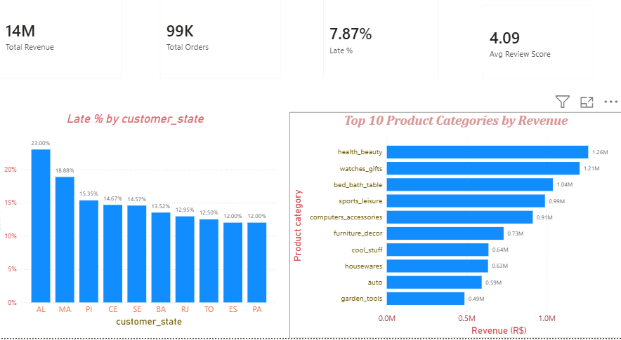
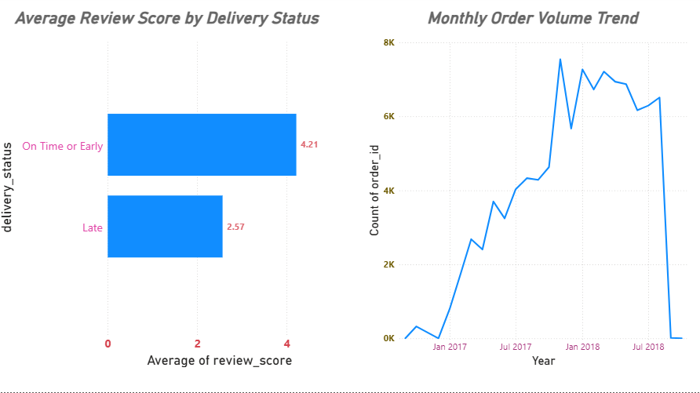

# Brazilian E-Commerce Analytics — Olist Dataset

End-to-end data analytics project exploring 99,000+ orders from the Olist Brazilian e-commerce platform, using **Python, SQL, and Power BI**. The project investigates what drives revenue and what drives customer satisfaction — with a focus on delivery performance.

## Dashboard

**Overview**


**Delivery Deep Dive**


## Problem Statement

Olist is a Brazilian e-commerce marketplace connecting small businesses to major retail channels. This project analyzes order, delivery, payment, and review data to answer:
- What product categories generate the most revenue?
- Does delivery performance affect customer satisfaction?
- Are delivery problems concentrated in specific regions?
- How has order volume changed over time?

## Key Findings

- **Delivery delay strongly predicts dissatisfaction.** Orders delivered late average a **2.57★** review vs **4.21★** for on-time/early orders — a drop of over 1.6 points.
- **~90% of all orders arrive earlier than estimated**, suggesting Olist intentionally pads delivery estimates — but the remaining ~6.3% that arrive late account for a disproportionate share of poor reviews.
- **Delivery delays are geographically concentrated.** Alagoas (AL) has a 20%+ late delivery rate, roughly 5x higher than top-performing states like São Paulo (SP) and Amazonas (AM) — pointing to a logistics/infrastructure gap in Brazil's North/Northeast regions.
- **Health & Beauty and Watches/Gifts are the top revenue categories**, each generating over R$1.25M — ahead of traditional big-ticket categories like electronics.
- **Bed/Bath/Table and Furniture/Decor** — both bulky, harder-to-ship categories — show the weakest review scores among top-10 revenue categories, consistent with the delivery-delay finding above.
- Order volume grew steadily from early 2017 through late 2018, peaking around 8,700 orders/month.

## Tech Stack

| Tool | Purpose |
|---|---|
| **Python** (Pandas, NumPy) | Data cleaning, merging 9 relational tables, exploratory analysis |
| **SQL** (MySQL) | Relational database queries, cross-verification of Python findings |
| **Power BI** | Interactive 2-page dashboard, DAX measures, data visualization |

## Methodology

1. **Data Loading & Cleaning** — Loaded 9 relational CSV files (~1.3M+ total rows), inspected for missing values, converted date columns to proper datetime types, and merged tables using shared keys (`order_id`, `customer_id`, `product_id`).
2. **Exploratory Analysis (Python)** — Investigated delivery delay distribution, regional delivery performance, category-level revenue, and payment behavior.
3. **SQL Verification** — Rebuilt key findings (delivery status vs. review score, category revenue) independently in SQL to confirm results across tools.
4. **Dashboard (Power BI)** — Built a 2-page interactive dashboard: an Overview page (KPIs + top-line findings) and a Delivery Deep Dive page (review score impact + order trend).

## Repository Structure

```
├── notebooks/
│   └── 01_data_exploration.ipynb    # Full Python analysis
├── sql/
│   └── queries.sql                  # Key SQL analysis queries
├── powerbi/
│   ├── overview_page.png            # Dashboard screenshot — Page 1
│   └── delivery_deep_dive.png       # Dashboard screenshot — Page 2
├── insights_log.md                  # Full findings log across all 3 phases
└── README.md
```

## Dataset

[Brazilian E-Commerce Public Dataset by Olist](https://www.kaggle.com/datasets/olistbr/brazilian-ecommerce) (Kaggle) — ~100,000 orders placed between 2016-2018 across multiple marketplaces in Brazil.

## Author

Shashwat Huvannavar — BCA Graduate | Data Analyst
[LinkedIn](https://www.linkedin.com/in/shashwat-huvannavar-91082a326) · shashwathuvannavar26@gmail.com
